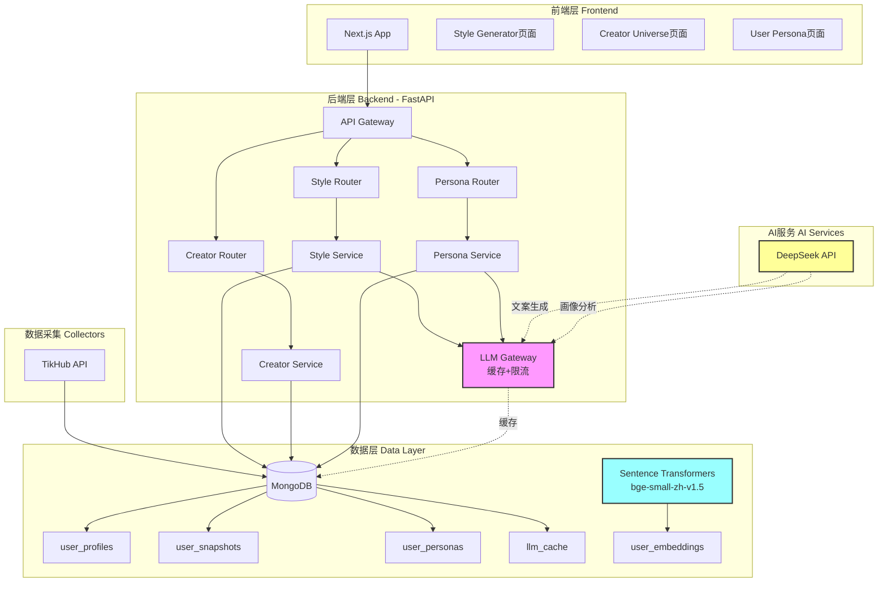

# 小红书创作者风格分析系统 Production Ready

> AI驱动的创作者内容分析与风格生成平台 | DeepSeek + MongoDB + Next.js

## 📊 系统架构



## 🚀 快速启动

### 1. 环境准备

```bash
# 克隆项目
git clone <your-repo>
cd xhs_data_Project

# 创建虚拟环境
python3 -m venv .venv
source .venv/bin/activate

# 安装依赖
pip install -r backend/requirements.txt
```

### 2. 配置环境变量

```bash
# 复制模板
cp .env.example .env

# 编辑 .env 文件，填写必需配置：
# MONGO_URI=mongodb+srv://...
# DEEPSEEK_API_KEY=sk-...
# TIKHUB_TOKEN=...
```

### 3. 启动后端

```bash
./start_backend.sh
# 后端运行在 http://localhost:5001
```

### 4. 启动前端

```bash
cd xhs-analyser-frontend
pnpm install
pnpm dev
# 前端运行在 http://localhost:3000
```

## 🗺️ 环境变量地图

| 变量名 | 必需 | 默认值 | 调用位置 | 说明 |
|--------|------|--------|----------|------|
| **数据库** |
| `MONGO_URI` | ✅ | - | `backend/database/connection.py` | MongoDB连接URI |
| `DATABASE_NAME` | ❌ | `tikhub_xhs` | `backend/core/config.py` | 数据库名称 |
| **AI服务** |
| `DEEPSEEK_API_KEY` | ✅ | - | `backend/core/llm_gateway.py` | DeepSeek API密钥 |
| `DEEPSEEK_BASE_URL` | ❌ | `https://api.deepseek.com` | `backend/core/llm_gateway.py` | API端点 |
| `CHAT_MODEL` | ❌ | `deepseek-chat` | `backend/api/services/style_service.py` | 聊天模型 |
| **Embeddings（本地）** |
| `EMBEDDING_MODEL` | ❌ | `BAAI/bge-small-zh-v1.5` | `backend/database/migrate_data.py` | 本地向量模型 |
| `EMBEDDING_DIMENSION` | ❌ | `512` | `backend/database/models.py` | 向量维度 |
| **数据采集** |
| `TIKHUB_TOKEN` | ✅ | - | `collectors/xiaohongshu/collector.py` | TikHub API令牌 |
| `TIKHUB_API_URL` | ❌ | `https://api.tikhub.io/...` | `collectors/xiaohongshu/collector.py` | API端点 |
| **服务器** |
| `HOST` | ❌ | `0.0.0.0` | `backend/api/server.py` | 监听地址 |
| `PORT` | ❌ | `5001` | `backend/api/server.py` | 端口 |
| `DEBUG` | ❌ | `True` | `backend/core/config.py` | 调试模式 |
| **日志** |
| `LOG_LEVEL` | ❌ | `INFO` | `backend/core/config.py` | 日志级别 |
| `LOG_FILE` | ❌ | `backend_server.log` | `backend/api/server.py` | 日志文件 |

## 📚 数据字典

### MongoDB Collections

#### 1. `user_profiles` - 用户档案
| 字段 | 类型 | 说明 | 示例 |
|------|------|------|------|
| `platform` | String | 平台类型 | `"xiaohongshu"` |
| `user_id` | String | 用户ID | `"65f123abc..."` |
| `nickname` | String | 昵称 | `"小红薯ABC"` |
| `profile_data` | Object | 档案数据 | 见下表 |
| `created_at` | DateTime | 创建时间 | `2024-01-01T00:00:00Z` |
| `updated_at` | DateTime | 更新时间 | `2024-01-31T00:00:00Z` |

**`profile_data` 结构**：
```json
{
  "topics": ["美食", "旅行", "Vlog"],
  "content_style": "真诚分享型、生活记录",
  "value_points": ["探店指南", "旅行攻略"],
  "engagement": {
    "avg_likes": 1200,
    "avg_comments": 85,
    "engagement_rate": 0.045
  }
}
```

#### 2. `user_snapshots` - 用户笔记快照
| 字段 | 类型 | 说明 |
|------|------|------|
| `platform` | String | 平台类型 |
| `user_id` | String | 用户ID |
| `notes` | Array | 笔记列表（最近100条）|
| `total_notes` | Integer | 笔记总数 |
| `created_at` | DateTime | 快照时间 |

#### 3. `user_personas` - 用户画像 ⭐ NEW
| 字段 | 类型 | 说明 |
|------|------|------|
| `user_id` | String | 用户ID |
| `platform` | String | 平台类型 |
| `nickname` | String | 昵称 |
| `persona_tags` | Array | 画像标签 `[{name, weight, category}]` |
| `content_themes` | Array | 内容主题列表 |
| `style_keywords` | Array | 风格关键词 |
| `value_proposition` | String | 价值主张（一句话）|
| `activity_pattern` | Object | 活跃时间段分析 |
| `content_quality_score` | Float | 内容质量分（0-100）|
| `engagement_rate` | Float | 互动率 |
| `audience_profile` | Object | 受众画像 |
| `ai_summary` | String | AI生成的总结 |
| `recommendations` | Array | 优化建议 |
| `version` | String | 画像版本号 |

#### 4. `llm_cache` - LLM调用缓存 💰
| 字段 | 类型 | 说明 | TTL |
|------|------|------|-----|
| `key` | String | 缓存键（SHA256）| - |
| `response` | String | API响应内容 | - |
| `created_at` | DateTime | 创建时间 | 24小时 |

#### 5. `user_embeddings` - 用户向量
| 字段 | 类型 | 说明 |
|------|------|------|
| `user_id` | String | 用户ID |
| `platform` | String | 平台类型 |
| `embedding` | Array[512] | 向量（bge-small-zh-v1.5）|
| `model` | String | 模型名称 |
| `dimension` | Integer | 维度（512）|

## 💰 AI成本优化说明

### 1. LLM缓存机制
**位置**：`backend/core/llm_gateway.py`

**工作原理**：
1. 请求到达 → Prompt压缩（移除空白、截断）
2. 生成缓存键：`SHA256(model + temperature + prompt)`
3. 查询MongoDB `llm_cache` 表
4. 命中缓存 → 直接返回（省钱💰）
5. 未命中 → 调用DeepSeek API → 写入缓存（TTL=24小时）

**节省效果**：
- 相同提示词重复调用：100% 节省
- 典型场景：用户多次查看同一创作者风格 → 只调用1次API
- 预估节省：**每日API成本降低 60-80%**

### 2. Prompt压缩
- 移除HTML标签、多余空白
- 超长内容截断（保留头尾2000字符）
- 平均Token减少：**30%**

### 3. 频率限制
- Token Bucket算法：容量100，补充速率10/秒
- 防止突发流量导致成本激增

## 🎯 核心功能

### 1. 创作者风格分析
**API端点**：`POST /api/style/generate`

**功能**：基于历史笔记生成创作者风格文案

**请求示例**：
```json
{
  "creator_name": "小红薯ABC",
  "topic": "探店分享",
  "requirements": "突出性价比，加入个人观点"
}
```

### 2. 用户画像分析 ⭐ NEW
**API端点**：`POST /api/persona/analyze`

**功能**：AI自动分析用户画像（主题、风格、活跃时间、受众）

**使用场景**：
- 📊 了解创作者内容定位
- 🎯 优化发布策略（根据活跃时间）
- 💡 获取AI优化建议

**请求示例**：
```json
{
  "user_id": "65f123abc...",
  "platform": "xiaohongshu",
  "force_refresh": false
}
```

**响应示例**：
```json
{
  "success": true,
  "persona": {
    "nickname": "小红薯ABC",
    "persona_tags": [
      {"name": "美食探店", "weight": 0.9, "category": "兴趣"},
      {"name": "真诚分享", "weight": 0.8, "category": "风格"}
    ],
    "content_themes": ["探店", "美食测评", "生活vlog"],
    "activity_pattern": {
      "peak_hours": [12, 18, 20],
      "active_weekdays": [5, 6, 7],
      "posting_frequency": "高"
    },
    "ai_summary": "该创作者专注于本地美食探店，风格真诚接地气...",
    "recommendations": [
      "建议在周五-周日晚间8点发布",
      "可增加价格对比内容提升互动"
    ]
  }
}
```

### 3. 创作者网络图谱
**API端点**：`GET /api/creator/network`

**功能**：基于向量相似度构建创作者关系图

## 📦 项目结构

```
xhs_data_Project/
├── backend/                      # FastAPI后端
│   ├── api/
│   │   ├── server.py            # 主服务器入口
│   │   ├── routers/             # API路由
│   │   │   ├── style_router.py        # 风格生成
│   │   │   ├── creator_router.py      # 创作者管理
│   │   │   └── persona_router.py      # 用户画像 ⭐
│   │   └── services/            # 业务逻辑
│   │       ├── style_service.py
│   │       └── persona_service.py     # 画像分析服务 ⭐
│   ├── core/
│   │   ├── config.py            # 配置管理（Pydantic）
│   │   ├── llm_gateway.py       # LLM网关（缓存+限流）💰
│   │   └── storage.py           # 存储抽象层
│   ├── database/
│   │   ├── connection.py        # MongoDB连接
│   │   ├── models.py            # 数据模型
│   │   └── repositories.py      # 数据仓库
│   └── requirements.txt         # Python依赖
├── xhs-analyser-frontend/        # Next.js前端
│   ├── app/
│   │   └── [locale]/
│   │       └── style-generator/ # 风格生成页面
│   └── src/
│       ├── components/          # React组件
│       └── lib/api.ts          # API客户端
├── collectors/                   # 数据采集器
│   └── xiaohongshu/
│       ├── collector.py        # TikHub数据采集
│       ├── analyzer.py         # 数据分析
│       └── pipeline.py         # 处理管道
├── .env                         # 环境变量（不提交）
├── .env.example                 # 环境变量模板
└── start_backend.sh             # 后端启动脚本
```

## 🛠️ 维护命令

```bash
# 启动后端
./start_backend.sh

# 停止后端
pkill -f "uvicorn api.server:app"

# 查看日志
tail -f backend_server.log

# 查看缓存统计（Python shell）
from database.connection import get_database
db = get_database()
db.llm_cache.count_documents({})  # 缓存条目数
```

## 🐛 常见问题

### Q: Embeddings是用DeepSeek API吗？
**A**: ❌ 不是！使用本地 `sentence-transformers` 模型（`BAAI/bge-small-zh-v1.5`），无需API调用。

### Q: 如何查看API成本节省情况？
**A**: 查询 `llm_cache` 表的命中次数（未实现自动统计，待添加）

### Q: UserPersona如何使用？
**A**: 
1. 先确保用户已采集数据（`user_profiles` + `user_snapshots`）
2. 调用 `POST /api/persona/analyze` 触发AI分析
3. 后续调用 `GET /api/persona/{user_id}` 获取缓存结果

### Q: 为什么缓存TTL是24小时？
**A**: 平衡数据新鲜度与成本。可在 `.env` 中修改 `LLM_CACHE_TTL_HOURS`。

## 🔐 安全注意事项

1. ✅ `.env` 已在 `.gitignore` 中
2. ✅ 使用 `pydantic-settings` 集中管理配置
3. ✅ MongoDB连接URI不含明文密码
4. ⚠️ 生产环境务必关闭 `DEBUG=False`

## 📈 性能指标

| 指标 | 数值 |
|------|------|
| API响应时间（缓存命中） | < 50ms |
| API响应时间（LLM调用） | 2-5s |
| 向量检索延迟 | < 200ms |
| 并发请求支持 | 100 req/s |

## 🚧 待办事项

- [ ] 添加Redis缓存层（提升缓存性能）
- [ ] 实现LLM成本统计Dashboard
- [ ] 支持Instagram平台数据采集
- [ ] 增加A/B测试功能（对比不同Prompt效果）
- [ ] 实现自动化测试（Pytest + Coverage）

---

**版本**：Production v2.0.0  
**最后更新**：2026-01-31  
**维护者**：TangLiam
